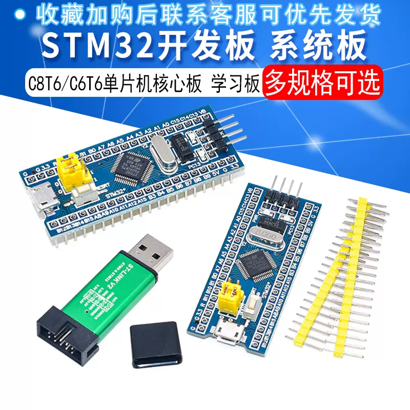
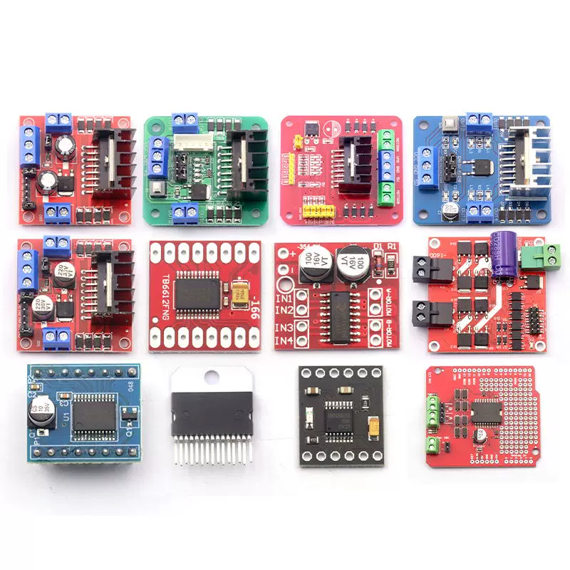

# Transit

This is a simulated unmanned bus project！

## 文件介绍

1. 模拟公交小车项目文件  

    > Drivers   Inc  MDK-ARM  Src  .mxproject  Transit

2. Transit项目图片资源文件夹

    > image

3. Transit项目帮助文档文件夹

    > README

## 硬件

1. 器材
  
    + 主控

    >[STM32最小系统板](https://detail.tmall.com/item.htm?_u=o3df1efpb3cb&id=537654639839&spm=a1z09.2.0.0.18042e8dyTTLlk)  
    > 

    + 电机

    >[N20直流减速编码电机](https://item.taobao.com/item.htm?spm=a1z09.2.0.0.35472e8diP1GXv&id=565304239241&_u=o3df1efp0b26)  
    > 

    + 驱动模块

    > [L298N电机驱动模块](https://detail.tmall.com/item.htm?_u=o3df1efpb03f&id=41248562401&spm=a1z09.2.0.0.35472e8diP1GXv)  
    > 

    + WiFi模块

    > [esp8266](https://item.taobao.com/item.htm?spm=a1z09.2.0.0.18042e8dyTTLlk&id=44511001458&_u=o3df1efp8e45)  
    > 

    + 电源

    > [Delipow18659户外音响锂电池组](https://detail.tmall.com/item.htm?_u=o3df1efp0af3&id=672530761618&spm=a1z09.2.0.0.3c362e8dbZfBZS)  
    > 

    + 万向轮

    >[万向轮](https://detail.tmall.com/item.htm?abbucket=2&id=694362291688&ns=1&spm=a230r.1.14.118.43f330beRehpb1)  
    > 

    + 循迹模块

    > [四路循迹](https://item.taobao.com/item.htm?spm=a1z09.2.0.0.18042e8dyTTLlk&id=557715054464&_u=o3df1efp116c)  
    >
